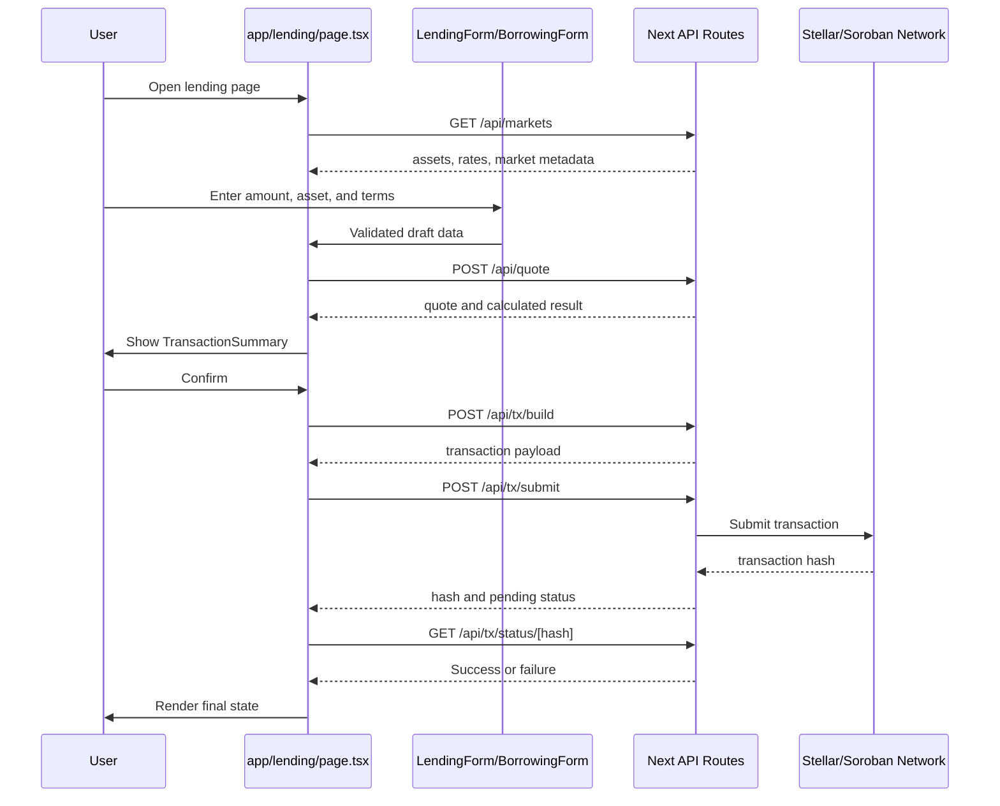

# Lending and Borrowing Data Flow

This guide traces how a lend or borrow action moves through the StellarLend frontend. It is intended for contributors who need one place to understand the page, forms, quote preview, transaction build, submission, and status polling flow.

## Primary Surfaces

The lending experience is centered on `app/lending/page.tsx`. That page coordinates the visible workflow and delegates specific concerns to feature components such as `LendingForm`, `BorrowingForm`, `TabSelector`, `InterestCalculator`, `TransactionSummary`, and `ConfirmModal`.

At a high level:

1. The page loads market and asset context.
2. The user selects lend or borrow with `TabSelector`.
3. The active form owns user-entered amount, asset, and rate fields.
4. The calculator and summary components derive preview state.
5. Confirmation builds and submits a transaction.
6. Status polling reports pending, successful, or failed outcomes.

## Component Graph

```text
app/lending/page.tsx
├── TabSelector
├── LendingForm
├── BorrowingForm
├── InterestCalculator
├── TransactionSummary
└── ConfirmModal
```

`app/lending/page.tsx` should own cross-form state such as `lendingData`, `borrowingData`, and `calculationResult`. Individual form components should keep field-level validation local and communicate submit-ready data through typed callbacks.

## Network Flow

The lend and borrow flows use the same API spine:

| Step | Endpoint | Purpose |
| --- | --- | --- |
| 1 | `/api/markets` | Load available assets, rates, and market metadata. |
| 2 | `/api/quote` | Preview expected lending or borrowing terms before a transaction is built. |
| 3 | `/api/tx/build` | Build the transaction XDR or transaction payload. |
| 4 | `/api/tx/submit` | Submit the signed transaction. |
| 5 | `/api/tx/status/[hash]` | Poll for the final transaction state. |

Keep API calls behind existing project helpers where available. UI components should not duplicate request parsing or error mapping when a shared helper already exists.

## Sequence Diagram



## Worked Example: Lend

1. The user selects the lend tab.
2. `LendingForm` validates the amount, selected asset, and rate boundaries.
3. The page requests `/api/quote` with the lend-side draft data.
4. `TransactionSummary` renders the preview: supplied asset, expected yield, fees, and relevant warnings.
5. `ConfirmModal` asks for confirmation before building the transaction.
6. `/api/tx/build` returns the transaction payload.
7. `/api/tx/submit` returns a transaction hash.
8. `/api/tx/status/[hash]` is polled until the result is `Success`, `Failed`, or a terminal timeout state.

## Worked Example: Borrow

1. The user selects the borrow tab.
2. `BorrowingForm` validates the borrow amount, collateral inputs, and any rate constraints.
3. The page requests `/api/quote` for the borrow preview.
4. `InterestCalculator` and `TransactionSummary` show repayment cost, collateral requirement, and risk information.
5. On confirmation, the page builds and submits the transaction through `/api/tx/build` and `/api/tx/submit`.
6. Status polling reports completion or failure through `/api/tx/status/[hash]`.

## Failure Paths

Handle these paths explicitly in the UI:

- `/api/markets` unavailable: show a recoverable loading/error state and keep forms disabled until market context exists.
- `/api/quote` rejection: show field-level or summary-level validation feedback without submitting a transaction.
- `429` rate limit: explain that the user should retry after the server-provided window.
- `/api/tx/build` failure: keep the user on the confirmation step with the original form data intact.
- `/api/tx/submit` failure: show the submit error and avoid reporting success without a hash.
- Transaction status `Failed`: show the hash and failure status so the user can inspect or retry safely.

## Related Documentation

- `CONTRIBUTING.md` for contributor workflow and testing expectations.
- `COMPONENT-CHECKLIST.md` for component quality checks.
- `POSITION_SUMMARY_TESTING_GUIDE.md` and related summary documents for adjacent data-flow patterns.
- `WEBHOOKS.md` for server-to-client event integration notes where applicable.