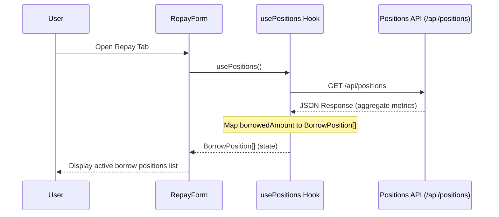

# Repay Flow and Live Positions Data Source

This document outlines how the repayment flow interacts with the live backend positions API in StellarLend.

## Data Flow Architecture

The repayment flow is designed to fetch outstanding debt directly from the user's active positions.

## Data Source API

The live positions endpoint is located at `/api/positions`.

### Response Schema
When authenticated, the GET request returns an object containing:
- `borrowedAmount`: A string representing the total borrowed funds formatted with asset (e.g. `"$1,500.00 XLM"`).
- `healthFactor`: Number representing the collateralization ratio health.
- `nextDue`: A string showing the next payment due date (e.g. `"$250.00 in 4 days"`).

## Custom Hook: `usePositions`

File: [hooks/usePositions.ts](file:///c:/Users/HP/Stellarlend-frontend/hooks/usePositions.ts)

The `usePositions` custom hook manages fetching and parsing positions:
- **Mapping:** Parses the `borrowedAmount` string to extract the numeric value and the asset symbol.
- **Robustness:** Supports both the current flat object format and potential array-based formats.
- **States:** Exposes `positions: BorrowPosition[]`, `isLoading: boolean`, `error: Error | null`, and a `refetch: () => Promise<void>` callback.

## Component: `RepayForm`

File: [components/features/lending/components/RepayForm.tsx](file:///c:/Users/HP/Stellarlend-frontend/components/features/lending/components/RepayForm.tsx)

The `RepayForm` component displays active borrows and handles user validation:
- **Override Prop:** Accepts `positions` directly as a prop for testing and storybook fixtures. Falls back to `usePositions` only when the prop is omitted.
- **Loading:** Renders pulse layout skeletons during active fetch.
- **Empty State:** Reuses the common `EmptyState` component when no borrow positions are active.
- **Toast Notifications:** Surfaces fetch errors to the user using a floating toast message overlay.
- **Validation:** Enforces that repayment amount is positive and does not exceed the outstanding position limit.
