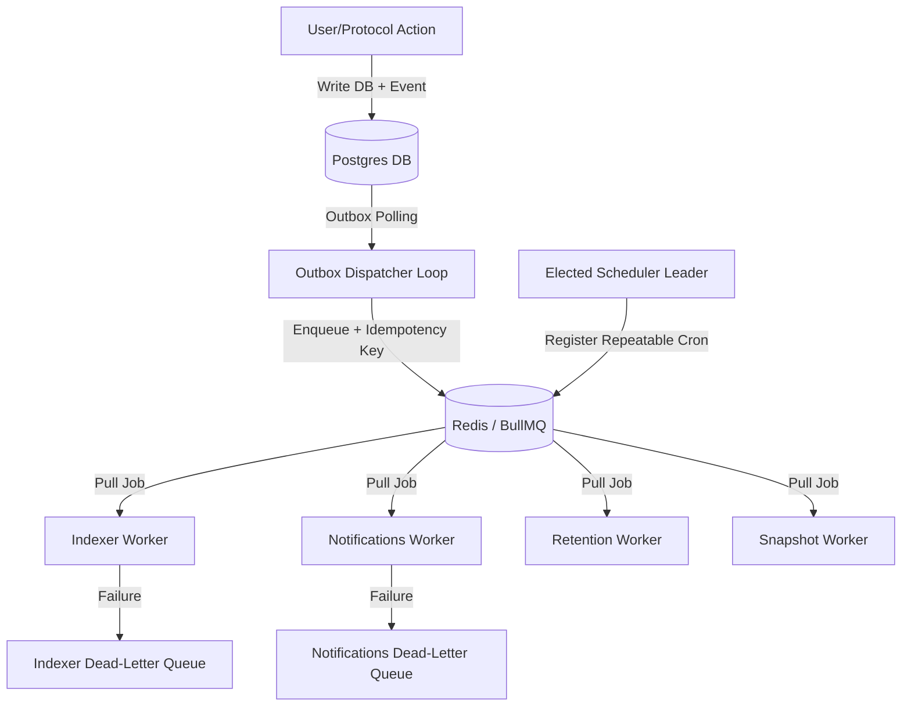

# Background Jobs & Workers Architecture

This guide describes the architecture of Stellarlend's background job processing, message scheduling, transactional outbox pattern, and fallback recovery mechanisms.

---

## 1. Architecture Overview

Stellarlend separates heavy, long-running, or resource-intensive tasks from the main Next.js API request-response cycle to ensure high-performance client interaction.

The background layer utilizes two primary patterns:
1. **BullMQ Queues**: A robust, Redis-backed job queueing framework for asynchronous tasks (e.g., transaction indexing, notifications).
2. **Transactional Outbox Pattern**: A database-driven pattern ensuring reliable, at-least-once message delivery across system boundaries without distributed transactions.



---

## 2. Worker Specifications & Triggers

Stellarlend includes five distinct background worker modules located in the `src/jobs` directory:

| Worker / Source File | Queue Name | Trigger Frequency | Primary Responsibility |
| :--- | :--- | :--- | :--- |
| **Indexer Worker**<br>`src/jobs/indexer.worker.ts` | `indexer-queue` | Dynamic / On-demand | Indexes on-chain transaction logs and historical balances for user wallets. Calls `indexAccountTransactions`. |
| **Notifications Worker**<br>`src/jobs/notifications.worker.ts` | `notifications-queue` | Dynamic / On-demand | Formats and saves user notifications into the database repository class using `addNotification`. |
| **Outbox Dispatcher**<br>`src/jobs/outbox-dispatcher.worker.ts` | Polling Loop | Continuous (1000ms) | Polls the `outboxEvents` table, transitions pending items to processing state in a transaction, and dispatches them to downstream BullMQ queues. |
| **Retention Worker**<br>`src/jobs/retention.worker.ts` | `retention-job` | Daily (`0 2 * * *`) | Cleans up historical data (`sessions`, `audit_events`, `position_snapshots`) exceeding configured retention Day TTLs. |
| **Snapshot Worker**<br>`src/jobs/snapshot.worker.ts` | `snapshot-job` | Daily (`0 0 * * *`) | Captures daily wallet position statistics (supplies, borrows, and effective APYs) for historical tracking charts. |

### Indexer Worker
- **Triggers**: Triggered when a new transaction is broadcast or when a user session starts. Enqueues a payload containing `accountId`.
- **Failure Recovery**: On maximum retry exhaustion, enqueues to the `indexer_dead_letter_queue` under event `index_account_failed` with crash context.

### Notifications Worker
- **Triggers**: Triggered by account margin updates, liquidations, lending status changes, or deposit completions.
- **Failure Recovery**: On maximum retry exhaustion, routes to `notifications_dead_letter_queue` under event `send_notification_failed`.

### Transactional Outbox Dispatcher
- **Triggers**: Polls the SQLite/PostgreSQL `outboxEvents` table every 1000ms.
- **Deduplication & Idempotency**: Installs the DB Outbox Event ID as the BullMQ `jobId`. Because BullMQ de-duplicates jobs with identical IDs in the queue, this guarantees that even if a network outage causes a crash mid-dispatch, no duplicate transactions or notifications will be executed.
- **Status Transitions**: `PENDING`/`FAILED` $\rightarrow$ `PROCESSING` (during execution) $\rightarrow$ `COMPLETED` (on success) OR `FAILED` (error threshold incremented, up to 3 times).

### Retention Worker
- **Triggers**: Scheduled daily at `02:00 UTC`.
- **Tuning**: Deletes data in batches of `1000` records in separate SQL statements to prevent long-running table locks. Honors `RETENTION_DRY_RUN=true` to log deletion candidates without executing deletes.

### Snapshot Worker
- **Triggers**: Scheduled daily at `00:00 UTC`.
- **Tuning**: Pulls positions from contracts/indexers and stores daily balance histories. Retains exactly the last 365 daily snapshots per wallet address, auto-purging anything older.

---

## 3. Scheduler & Multi-Replica Leader Election

The scheduling and registration of periodic/repeatable tasks is managed by `lib/jobs/scheduler.ts` and configured in `src/jobs/cron.ts`.

### Leader Election via pg_try_advisory_lock
When scaling the application across multiple container replicas, coordinating scheduled cron registration is crucial to avoid double-scheduling or race conditions.
- The scheduler connects to PostgreSQL and attempts to acquire an advisory session lock using a constant key pair:
  ```sql
  SELECT pg_try_advisory_lock(1398033484, 1129271310) AS acquired; -- [0x53544c4c, 0x43524f4e] (STLL / CRON)
  ```
- **Leader Replica**: Re-checks and acquires/keeps the lock, completing the cron registration list.
- **Standby Replicas**: Periodically attempt to acquire the lock every 30 seconds (election interval) but release and sleep if it remains locked.

### Failover Recovery
- Postgres automatically releases advisory session locks if the client process holding them dies, loses its network connection, or shuts down.
- On the next 30-second interval sweep, the first standby replica to poll will successfully acquire the advisory lock, transition to Scheduler Leader, and immediately run the idempotent scheduler registry flow.
- Because BullMQ repeatable job registration checks if the job pattern name already exists before adding, failover is seamlessly idempotent.

### Prometheus Metrics
The scheduler updates a telemetry gauge registered under `/api/metrics`:
- **`scheduler_is_leader`**: `1` (active scheduler leader process), `0` (standby replica).

---

## 4. Local Development & Running Workers

In Stellarlend, importing a worker file automatically initializes the BullMQ process loop by creating a new `Worker` class in the module scope. In local development or staging, you can run workers individually or collectively.

### Running a Single Worker Locally
You can run any worker process standalone using `ts-node` from the workspace root:

```bash
# Start the Transaction Indexer Worker
npx ts-node src/jobs/indexer.worker.ts

# Start the Notification Dispatcher Worker
npx ts-node src/jobs/notifications.worker.ts

# Start the Transactional Outbox Dispatcher service
npx ts-node src/jobs/outbox-dispatcher.worker.ts
```

### Required Configuration Env Vars
To run workers successfully, ensure your local environment contains a running Redis instance and the following keys:
```env
REDIS_URL=redis://localhost:6379
DATABASE_URL=postgres://postgresConf...
```

### graceful Shutdown
All workers register event listeners for system signals (`SIGINT` and `SIGTERM`). They hook into these processes to close redis/database pools cleanly via `worker.close()` and `connection.quit()`, preventing active jobs from getting stuck in an undefined lock state.

---

## 5. References & Cross-Links

- **Scheduler Internals**: [lib/jobs/scheduler.ts](../lib/jobs/scheduler.ts)
- **Cron Job Configuration**: [src/jobs/cron.ts](../src/jobs/cron.ts)
- **Detailed Leader Election Notes**: [docs/scheduler-leader-election.md](scheduler-leader-election.md)
- **Detailed Data Retention Specs**: [docs/retention.md](retention.md)
