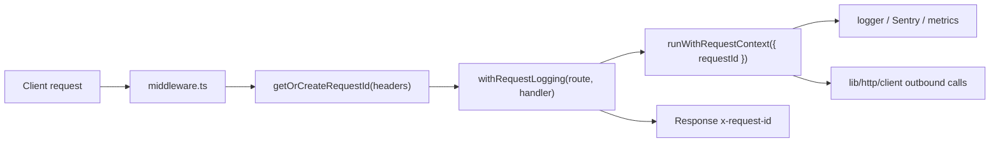

# Request Tracing

Stellarlend uses a single `x-request-id` value to correlate API responses, logs, Sentry errors, metrics, and outbound HTTP calls.



## Header Format

`lib/request-id.ts` exports `REQUEST_ID_HEADER`, currently `x-request-id`.

Request ids are ULIDs:

- 26 Crockford Base32 characters.
- Uppercase after normalization.
- Validated by `normalizeRequestId(value)`.
- Generated by `generateRequestId()` when the incoming header is missing or malformed.

`getOrCreateRequestId(headers)` returns the normalized inbound id when valid, or a new ULID when not:

```ts
import { getOrCreateRequestId, REQUEST_ID_HEADER } from '@/lib/request-id';

const { requestId, wasGenerated } = getOrCreateRequestId(request.headers);
response.headers.set(REQUEST_ID_HEADER, requestId);
```

Use `wasGenerated` only when the caller needs to distinguish client-provided ids from server-generated ids.

## Inbound Flow

`middleware.ts` applies request-id correlation to `/api/:path*`:

- Valid inbound `x-request-id` headers are preserved.
- Missing or malformed ids are replaced with a generated ULID.
- The normalized id is written back into the forwarded request headers.
- Every middleware response includes the final `x-request-id` response header.

API routes should still use `withRequestLogging(route, handler)`. The wrapper calls `getOrCreateRequestId()` again as a route-level guard, stores the id in request context, and sets the final response header:

```ts
import { withRequestLogging } from '@/lib/api/handler';

export const GET = withRequestLogging('/api/example', async () => {
  return Response.json({ ok: true });
});
```

## Request Context

`lib/request-context.ts` wraps request execution with `AsyncLocalStorage`.

Use `runWithRequestContext({ requestId }, callback)` when introducing a new server entrypoint that does not already use `withRequestLogging`.

Use `getActiveRequestId()` in lower-level server libraries that need the current request id:

```ts
import { getActiveRequestId } from '@/lib/request-context';

const requestId = getActiveRequestId();
```

`getActiveRequestId()` returns `undefined` outside an active request context. In that case, either omit the id or generate a fresh boundary id before making an outbound request.

## Logs, Sentry, And Metrics

`lib/logger.ts` automatically reads `getActiveRequestId()` and injects it into structured log context, so callers do not need to pass `requestId` manually:

```ts
logger.info('request completed', '/api/example', { status: 200 });
```

`withRequestLogging` also sends the id to `captureServerError()` on unhandled route errors. `lib/telemetry/sentry.ts` maps the value to the `request_id` Sentry tag:

```ts
captureServerError(error, {
  method: 'POST',
  requestId: getActiveRequestId(),
  route: '/api/example',
});
```

Metrics use bounded labels such as `method`, `route`, and `status`; keep request ids out of metric labels to avoid high cardinality.

## Outbound Propagation

Use `lib/http/client.ts` helpers for service-to-service calls. They set `x-request-id` in this order:

1. Preserve a valid explicit header already provided in the call options.
2. Reuse `getActiveRequestId()` from the current request context.
3. Generate a new ULID when there is no active context.

```ts
await httpGet('https://upstream.example/api');
```

If you call `fetch` directly, forward `REQUEST_ID_HEADER` yourself or explain why the call starts a new trace boundary.

## Edge Cases

- A malformed inbound id is not forwarded; it is replaced with a generated ULID.
- A missing inbound id is generated once at the boundary and echoed in the response.
- Reads outside `runWithRequestContext()` return `undefined`.
- Request ids are safe for logs, but they are not authentication material and must not be treated as secrets.
