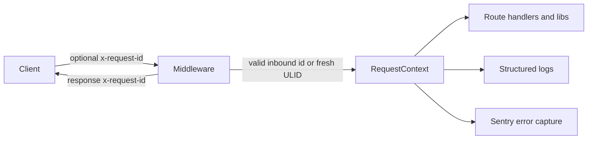

# Request tracing and request-id propagation

This document explains how the application correlates server requests with a single request id. The flow is driven by the `x-request-id` header, a ULID generated or validated in [lib/request-id.ts](../lib/request-id.ts), and a request-scoped context stored in [lib/request-context.ts](../lib/request-context.ts).

## Overview



## 1. Header and identifier format

The header name is `REQUEST_ID_HEADER`, which is defined as `x-request-id` in [lib/request-id.ts](../lib/request-id.ts).

The implementation uses a ULID shape with 26 Crockford Base32 characters:

- `generateRequestId()` creates a new ULID using the current timestamp and cryptographically secure randomness.
- `normalizeRequestId()` accepts only a trimmed, uppercase value that matches the ULID pattern.
- `getOrCreateRequestId(headers)` reuses a valid incoming value and returns `wasGenerated: false`.
- When the header is missing or malformed, it generates a fresh ULID and returns `wasGenerated: true`.

Example:

```ts
import { getOrCreateRequestId, REQUEST_ID_HEADER } from '@/lib/request-id';

const { requestId, wasGenerated } = getOrCreateRequestId(request.headers);
console.log({ header: REQUEST_ID_HEADER, requestId, wasGenerated });
```

## 2. Middleware propagation

The middleware in [middleware.ts](../middleware.ts) runs for every `/api/*` route and performs the following steps:

1. Calls `getOrCreateRequestId(request.headers)` to resolve the request id.
2. Copies that value onto the forwarded request headers.
3. Sets the same value on the outgoing response headers.

This means the behavior is:

- Valid inbound `x-request-id` values are preserved and reused.
- Missing or malformed values trigger generation of a new ULID.
- The final value is always exposed back to the caller through the response header.

Example request:

```bash
curl -H 'x-request-id: 01HZ0000000000000000000000' \
  http://localhost:3000/api/health
```

## 3. Request-scoped context

The request context lives in [lib/request-context.ts](../lib/request-context.ts) and uses Node's `AsyncLocalStorage`.

```ts
import { runWithRequestContext, getActiveRequestId } from '@/lib/request-context';

runWithRequestContext({ requestId: '01HZ0000000000000000000000' }, () => {
  const requestId = getActiveRequestId();
  console.log(requestId);
});
```

The API surface is intentionally small:

- `runWithRequestContext(context, callback)` sets the current request context for the callback.
- `getRequestContext()` returns the full context object for the current scope.
- `getActiveRequestId()` returns the current request id, or `undefined` when there is no active request context.

### In route handlers

The shared API wrapper in [lib/api/handler.ts](../lib/api/handler.ts) creates the request context before invoking the handler, so route code can read the active id directly:

```ts
import { getActiveRequestId } from '@/lib/request-context';

export async function GET(request: Request) {
  const requestId = getActiveRequestId();
  return Response.json({ requestId });
}
```

### In libraries and utilities

Libraries that run during request handling should read the current value from the context rather than relying on a global or a parameter thread.

```ts
import { getActiveRequestId } from '@/lib/request-context';

export function buildAuditContext() {
  return { requestId: getActiveRequestId() };
}
```

## 4. Logging

The logger in [lib/logger.ts](../lib/logger.ts) reads the active request id automatically and adds it to the structured log context whenever the call occurs inside request scope.

```ts
import { logger } from '@/lib/logger';

logger.info('request completed', '/api/health', { status: 200 });
```

When the logger runs within request context, the emitted JSON includes a `requestId` field alongside the rest of the structured metadata.

## 5. Sentry

The Sentry helper in [lib/telemetry/sentry.ts](../lib/telemetry/sentry.ts) accepts a `requestId` in its context object and records it as a Sentry tag.

```ts
import { getActiveRequestId } from '@/lib/request-context';
import { captureServerError } from '@/lib/telemetry/sentry';

captureServerError(error, {
  route: '/api/health',
  requestId: getActiveRequestId(),
});
```

That makes the request id visible in Sentry while preserving the route, method, and session metadata.

## 6. Practical guidance

- Preserve an incoming `x-request-id` when it already contains a valid ULID.
- Let the middleware generate a fresh id when the header is missing or malformed.
- Expect `getActiveRequestId()` to return `undefined` when called outside an active request-scoped run.
- Prefer reading the current request id from the active context rather than threading it through every function signature unless you are crossing process boundaries.
