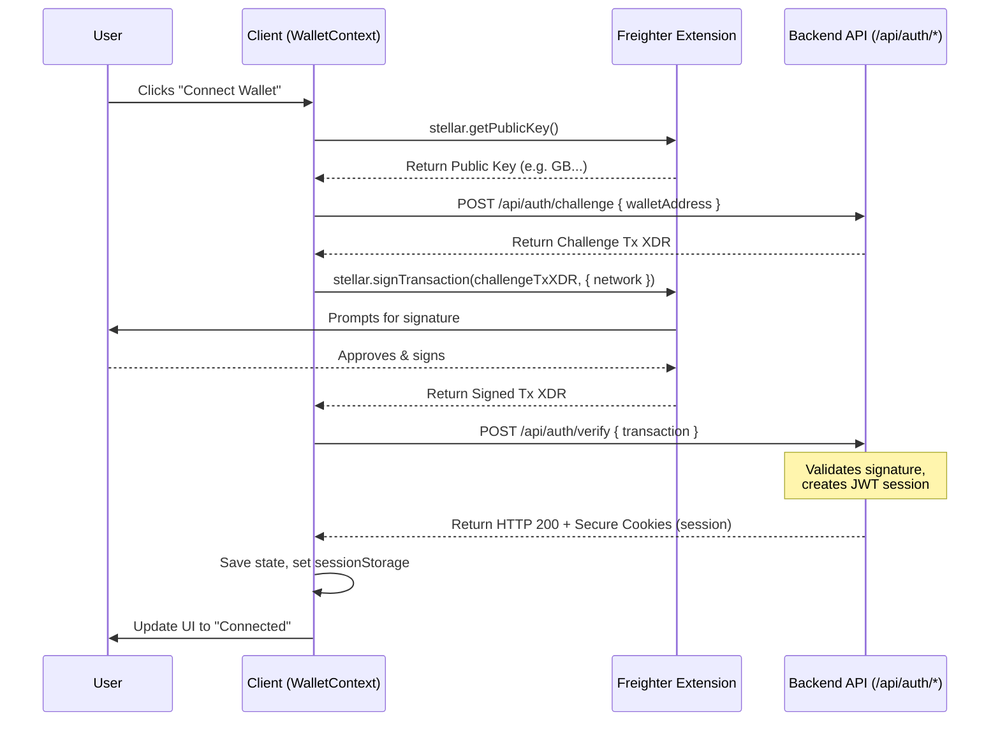

# Wallet Integration Guide

This guide describes how to integrate and consume the Stellar wallet connection using the `WalletContext` and the `useWallet` hook in the Stellarlend frontend. It details the connection lifecycle, network configuration, mismatch handling, and provides integration patterns for components.

---

## 1. Core Integration Components

The application provides a single client-side source of truth for the connected wallet state, exposed through a React Context Provider and a custom hook.

- **Context Provider**: `context/WalletContext.tsx`
- **Custom Hook**: `hooks/useWallet.ts`

### Hook Interface: `useWallet`
Consuming components should use the `useWallet` wrapper hook to access state and events:

```typescript
import { useWallet } from "@/hooks/useWallet";

const {
  address,      // string | null - Connected public key (G... address)
  network,      // 'PUBLIC' | 'TESTNET' - Current Stellar network
  status,       // WalletStatus - 'disconnected' | 'connecting' | 'connected' | 'error'
  error,        // string | null - Error message from connection failure
  connect,      // () => Promise<void> - Main method to initiate connection
  disconnect,   // () => Promise<void> - Logout and terminate session
} = useWallet();
```

---

## 2. Connect & Disconnect Lifecycle

The wallet connection follows a secure **SEP-10 challenge-response authentication lifecycle** to verify ownership on the server before starting a session.

### Connection Flow


1. **Freighter Handshake**: Checks for in-browser injected `window.stellar` provider and requests the public key (`getPublicKey`).
2. **Challenge Request**: Sends the public key to `/api/auth/challenge` to obtain a challenge transaction XDR generated by the server.
3. **Transaction Signing**: Prompts the user to sign the Challenge XDR using Freighter, specifying the active network.
4. **Signature Verification**: Sends the signed XDR to `/api/auth/verify`. The server validates the signature, sets a secure `httpOnly` JWT session cookie, and returns the verified address.
5. **State Update**: Updates internal state parameters (`address`, `status`, `error`) and saves the address in `sessionStorage` for instant rehydration upon next mount.

### Disconnection Flow
1. **API Notification**: Calls `DELETE /api/auth/session` to request the server to destroy the session cookie.
2. **State Purging**: Safely clears client-side state (`setAddress(null)` and `setStatus("disconnected")`) and removes the address from `sessionStorage` regardless of whether the API call succeeded (ensuring local privacy).
3. **Redirections**: If a `returnUrl` is present in the query parameters, the user is redirected to the safe path.

---

## 3. Network Detection & Mismatch Handling

Network parameters must match across the frontend application, the backend API, and the user's wallet extension.

### Configuration Mapping
The current active network is defined in the environment via `NEXT_PUBLIC_STELLAR_NETWORK` and is exposed by `config.stellar.network`. The `WalletProvider` maps this string to the canonical Stellar network names:
- `mainnet` or `public` $\rightarrow$ **`PUBLIC`**
- `testnet` (or others) $\rightarrow$ **`TESTNET`**

### Active Mismatch Prevention
When signing transactions via Freighter, the network passphrase is explicitly provided:
```typescript
const signedTransaction = await stellar.signTransaction(transaction, {
  network: "TESTNET" // or "PUBLIC"
});
```

### Error Mitigation
If the user's Freighter extension is configured to a different network (e.g., Freighter set to Mainnet while Stellarlend runs on Testnet):
- Freighter will reject the signature request or raise a signature network mismatch exception.
- Even if custom signing bypasses Freighter checks, the backend signature verification endpoint (`/api/auth/verify`) will reject the mismatched transaction and return a `400 Bad Request` or validation error.
- The `WalletContext` catches this error, transitions the status to `"error"`, and sets `error` to the returned failure message to inform the user.

---

## 4. Consumer Patterns & Examples

### Basic Connect/Disconnect Button
```tsx
"use client";

import React from "react";
import { useWallet } from "@/hooks/useWallet";

export const WalletButton = () => {
  const { address, status, error, connect, disconnect } = useWallet();
  const loading = status === "connecting";

  if (address) {
    return (
      <div className="flex items-center gap-3">
        <span className="text-sm font-mono bg-slate-100 p-2 rounded">
          {address.slice(0, 6)}...{address.slice(-4)}
        </span>
        <button
          onClick={disconnect}
          className="px-4 py-2 text-sm bg-red-600 text-white rounded hover:bg-red-700"
        >
          Disconnect
        </button>
      </div>
    );
  }

  return (
    <div className="flex flex-col items-start gap-1">
      <button
        onClick={connect}
        disabled={loading}
        className="px-5 py-2.5 bg-green-600 text-white font-semibold rounded hover:bg-green-700 disabled:opacity-50"
      >
        {loading ? "Connecting..." : "Connect Wallet"}
      </button>
      {error && <p className="text-xs text-red-500">{error}</p>}
    </div>
  );
};
```

### Route & Interaction Guard (WalletGate Pattern)
Wrap components or forms that require an active wallet connection with a component that prompts connection:
```tsx
"use client";

import React from "react";
import { useWallet } from "@/hooks/useWallet";

interface WalletGateProps {
  children: React.ReactNode;
  fallbackText?: string;
}

export const WalletGate = ({ children, fallbackText = "Please connect your wallet to proceed" }: WalletGateProps) => {
  const { address, status, connect } = useWallet();
  const isLoading = status === "connecting";

  if (!address) {
    return (
      <div className="p-6 border border-dashed border-slate-300 rounded-xl text-center flex flex-col items-center gap-4">
        <p className="text-slate-600">{fallbackText}</p>
        <button
          onClick={connect}
          disabled={isLoading}
          className="px-6 py-3 bg-green-600 text-white font-semibold rounded-lg hover:bg-green-700 disabled:opacity-50"
        >
          {isLoading ? "Connecting Wallet..." : "Connect Wallet"}
        </button>
      </div>
    );
  }

  return <>{children}</>;
};
```

---

## 5. Directory Mapping & References

- Core Wallet State: [context/WalletContext.tsx](../context/WalletContext.tsx)
- Unified Hook: [hooks/useWallet.ts](../hooks/useWallet.ts)
- Main Layout Header Usage: [Header.tsx](../components/organisms/Header/Header.tsx)
- Top Navigation Bar Hook Call: [TopNav.tsx](../components/shared/layout/TopNav.tsx)
- Backend Authentication Specs: [docs/AUTH.md](AUTH.md)
